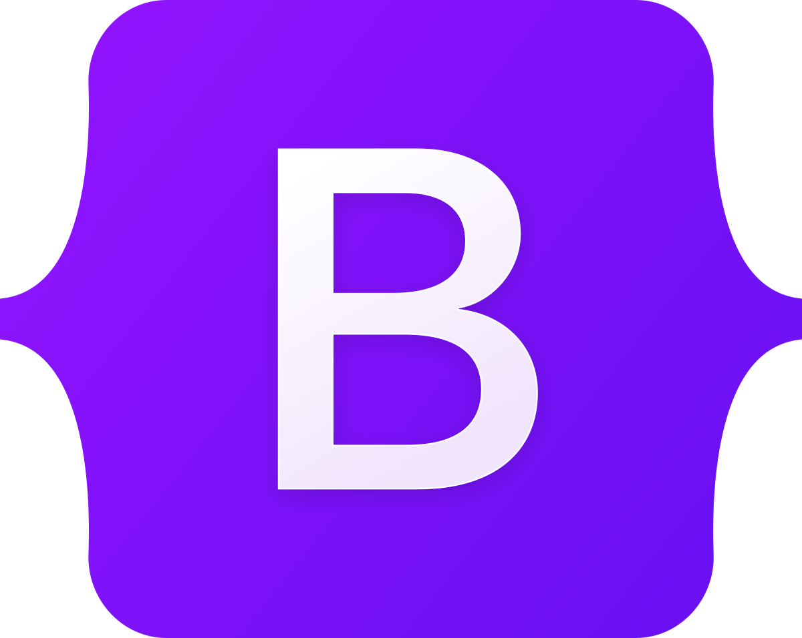

<h1 align="center">Hi 👋, I'm Meshal</h1>
<h3 align="center">Generate obfuscated meterpreter shells</h3>

  

- 💬 Ask me about **Python**

- 📫 How to reach me **mashe3l.id@gmail.com**

<h3 align="left">Connect with me:</h3>

  

<h3 align="left">Languages and Tools:</h3>
<h1 align="center"> Languages/Frameworks I'm good at: </h1>

  <code></code>
  <code></code>
  <code></code>
  <code></code>
  <code></code>
  <code></code>
  <code></code>
  <code></code>
  <code></code>
  <code></code>
  <code></code>

 

<h1 align="center"> Languages/Frameworks I'm learning: </h1>

  <code></code>
  <code></code>
  <code></code>
  <code></code>
  <code></code>
  <code></code>

 

<h1 align="center"> Environments I work with: </h1>

  <code></code>
  <code></code>
  <code></code>
  <code></code>

 

<h3 align="left">Support:</h3>

  

